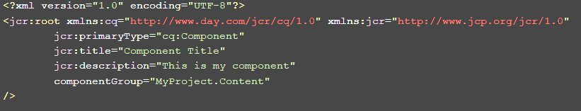
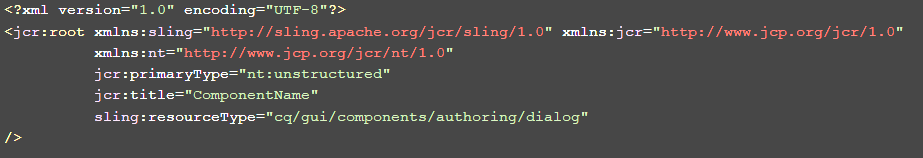
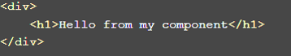
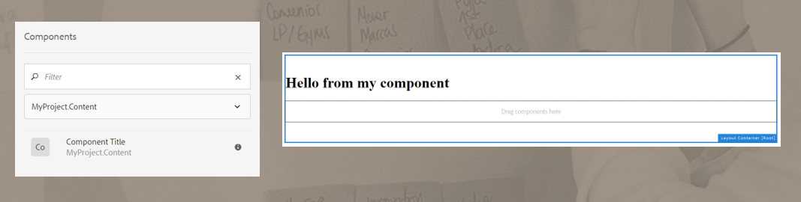

# AEM project example

This is an AEM Project example based on Maven Archetype 15. 

## Requirements

* Java 1.8
* Apache Maven (3.39 or newer)
* AEM 6.3 or 6.4
* IDE
* AEM integration tool with IDE (optional)

## Modules

The main parts of the project are:

* <b>core:</b> Java bundle containing all core functionality like OSGi services, listeners or schedulers, as well as component-related Java code such as servlets or request filters.
* <b>ui.apps:</b> contains the /apps (and /etc) parts of the project, JS & CSS clientlibs, components, templates, runmode specific configs as well as Hobbes-tests
* <b>ui.content:</b> contains sample content using the components from the ui.apps

## How to build

To build all the modules run in the project root directory the following command with Maven 3:

    mvn clean install

If you have a running AEM instance you can build and package the whole project and deploy into AEM with  

    mvn clean install -PautoInstallPackage
## How to create a component
For create a component follow the steps below:
* Inside the components folder (<b>ui.apps\src\main\content\jcr_root\apps\ExampleAEM\components</b>) create a folder with your
component name
* Inside this folder that you created:  
    * add a "<b>.content.xml</b>" file with a content like this:  
      
    * add a "<b>_cq_dialog.xml</b>" file with a content like this:  
       
    * add a "<b>yourComponent.html</b>" file with a content like this:  
      
* After building and re-deploying, you will have your component enabled on the sidekick and you can use it in a template:  
    
## How to enable components style

Go to client libs base folder (<b>ui.apps\src\main\content\jcr_root\apps\ExampleAEM\clientlibs\clientlib-base)</b>
and in the <b>.content.xml</b> file, copy and paste the following line below the <b>categories</b> line:
    
    dependencies="[aem-example.components]
    
After this, the styles for the <b>logo</b> and the <b>user</b> component are enabled. If you want to create your own styles for your 
components, follow the steps below:

* On the client libs components folder (<b>ui.apps\src\main\content\jcr_root\apps\ExampleAEM\clientlibs\clientlib-components</b>)
create a folder with the same name of your component.
* Inside this folder that you created, add a <b>less</b> file with your component style definition 
* Open the <b>style.less</b> file (inside the client libs components folder) and add an import statement like this:

    <pre>@import "yourFolder/yourComponentStyle.less"</pre>

    Being <b>"yourFolder"</b> the folder that you created and <b>"yourComponentStyle.less"</b> the less file with your component style definition.

